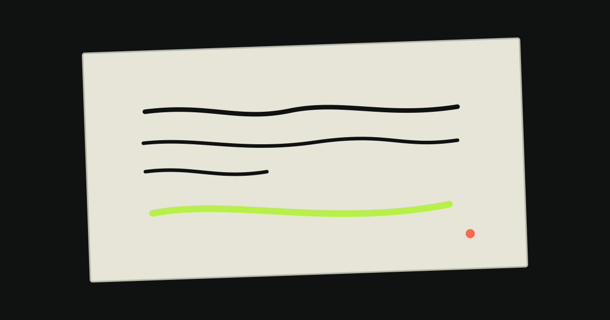
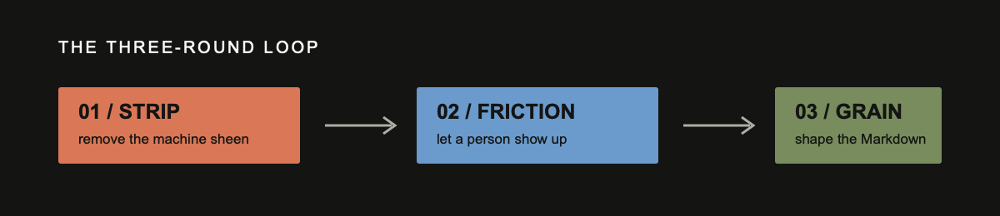

# Human Grain｜人间颗粒

> Make documents feel written, not generated.
>
> 让文档像人写的，不像机器生成的。



Human Grain 是一个给 Codex / Claude Code 使用的 writing skill。
它不负责把文章润色得更漂亮，反而会把过度整齐的句子、段落和 Markdown 结构拆开一点，留下可控的人的痕迹。

## 适合什么

- 已经写好的文档：去掉 AI 套话，改成像工作稿
- 只有几个要点：直接生成一份不太工整但能继续改的初稿
- 只想修一段：局部修复，不把整篇重写
- 同一份材料：按不同读者生成另一种“人写变体”
- 会议记录、聊天片段、待办清单：整理成能用的文档，但不抹平原始痕迹
- 未完稿续写、提纲转工作稿、日报/进度碎片整理（实验入口）

## 核心流程

每次固定跑三轮：



1. **去机器味**：删套话、拆均匀句式、保留事实和判断
2. **加人为感**：加入具体场景、停顿、自我修正和少量口语
3. **改 Markdown**：用有理由的非对称标题、列表、旁注和短段落制造颗粒

粗糙度从 1 到 5 可调。默认 3/5，`typo_noise` 默认关闭。医疗、法律、财务、安全、代码、配置和对外承诺自动降级为 `safe` profile：只改套话和句长，不改结构、顺序或关键字段。

这里有三种不同层级的“三轮”，不要混为一谈：`THREE-ROUNDS.md` 是一次性的设计 loop；`SKILL.md` 的 Detect → Voice → Format 是每份文档都要执行的运行 loop；`STRICT-TESTS.md` 是发布前可重复的验证 loop。三者分别验证“怎么设计”“怎么产出”“有没有坏”。

## 安装

把 `human-grain/` 放入 Codex 的 skills 目录（通常是 `~/.codex/skills/`），或放入 Claude Code 的 skills 目录（通常是项目级 `.claude/skills/`），然后直接引用：

```text
使用 $human-grain-writer，把这份 Markdown 按 3/5 粗糙度改得像人写的。
```

支持的入口、信息不足时的处理和扩展模式见 [`references/modes.md`](references/modes.md)。

## 一个小例子

原文：

```markdown
在数字化转型的时代背景下，本项目旨在全面提升团队协作效率，打造高效闭环。
```

处理后：

```markdown
团队现在不是没有工具。是工具太多了。

消息在群里，任务在表格，最后谁来做经常要再问一遍。先把任务、负责人和截止时间放到一个地方，其他的后面再说。
```

完整前后对照见 [`examples/`](examples/)。设计取舍见 [`DESIGN.md`](DESIGN.md)，三轮迭代记录见 [`THREE-ROUNDS.md`](THREE-ROUNDS.md)，严格测试记录见 [`STRICT-TESTS.md`](STRICT-TESTS.md)。

设计依据和公开参考见 [`RESEARCH.md`](RESEARCH.md)。

## 粗糙度不是随机损坏

Human Grain 不使用连续乱码，也不会为了“像人”伪造经历或来源。它把人为感拆成两条轴：

| 轴 | 控制什么 |
| --- | --- |
| 内容颗粒 | 口语、停顿、重复、自我修正、少量错别字 |
| 格式颗粒 | 不对称标题、短段、旁注、临时标记、局部断裂 |

格式变化必须服务于阅读节奏。可读性和事实准确性永远优先。

## FAQ

**会不会把文章故意写得很差？**

不会随机损坏。它用有限的内容和格式动作制造人为颗粒，事实、代码、链接和关键字段优先保持准确。

**能不能只改一段？**

可以。使用 `repair` 并给出范围；没有范围时会先请求确认。

**是否保证避开检测？**

不保证，也不以规避检测为目标。它只改善可读性、作者感和结构自然度。

## 项目文件

```text
SKILL.md                 核心规则
agents/openai.yaml       客户端展示信息
references/              模式、颗粒度、格式和模型复核参考
examples/                修改前/修改后/极致实验稿
tests/cases/              五组输入输出 fixture
DESIGN.md                设计思路与非目标
RESEARCH.md              本地与公开参考来源
THREE-ROUNDS.md          设计 loop 的发散、约束、收敛记录
STRICT-TESTS.md           运行 loop 的三轮审查与五组回放
assets/                   PNG 预览、SVG 源文件和素材 provenance
scripts/check_skill.sh    结构检查
scripts/strict_audit.sh   严格审查入口
```

## 贡献

欢迎提交新的中文场景 fixture、格式动作案例和失败样本。请同时说明输入、粗糙度、期望保留的事实，以及为什么这个输出仍然可读。

## License

MIT，见 [`LICENSE`](LICENSE)。
