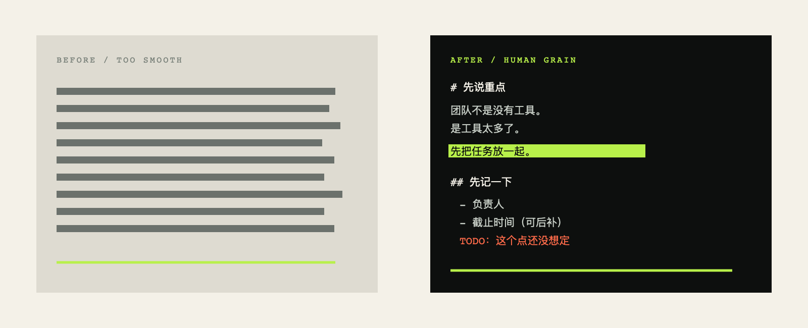

<p align="center">
  
</p>

<h1 align="center">Human Grain｜人间颗粒</h1>

<p align="center">
  <strong>A Markdown skill for text with a pulse.</strong><br>
  让文档像人写的，不像机器生成的。
</p>

<p align="center">
  <a href="https://github.com/ZhaoXingPeng/human-grain/actions/workflows/validate.yml"></a>
  <a href="LICENSE"></a>
  <a href="examples/"></a>
</p>

<p align="center">
  <a href="#quickstart">Quickstart</a> ·
  <a href="#what-changes">What changes</a> ·
  <a href="#modes">Modes</a> ·
  <a href="examples/">Examples</a> ·
  <a href="DESIGN.md">Design</a> ·
  <a href="RESEARCH.md">Research</a>
</p>

Human Grain 是一个给 Codex / Claude Code 用的 writing skill。它做的事情很具体：去掉 AI 常见的整齐和套话，再按可控的粗糙度，让句子、段落和 Markdown 留下一点人的停顿、判断和毛边。

它不是随机损坏器，也不承诺绕过任何检测。事实、链接、代码和关键字段先保住；人为感来自具体场景、局部不对称和可回滚的小噪声。

## The loop

每份文档都走三轮。不是把同一个 prompt 重复三次，而是每轮解决一个不同的问题。

<p align="center"></p>

| Round | 做什么 | 产出 |
| --- | --- | --- |
| 01 / Strip | 找 AI tell、删空话、保留事实 | 一份不再像模板的底稿 |
| 02 / Friction | 复用已有场景，加入判断、停顿和不均匀节奏 | 有作者感的正文 |
| 03 / Grain | 按来源和阅读节奏挑 2-4 种 Markdown 动作 | 灵动但仍可解析的格式 |

## Quickstart

```bash
git clone git@github.com:ZhaoXingPeng/human-grain.git ~/.codex/skills/human-grain-writer
cd ~/.codex/skills/human-grain-writer
./scripts/check_skill.sh
```

Claude Code 项目级安装：把同一目录复制到项目的 `.claude/skills/human-grain-writer/`，然后重启会话。

然后在 Codex 或 Claude Code 中调用：

```text
使用 $human-grain-writer，把这份 Markdown 按 3/5 改成像人写的版本。
格式要灵动，不要随机乱；事实、链接、代码和关键字段不要动。
```

想要更强烈的版本：

```text
使用 $human-grain-writer，profile=extreme，typo_noise=on。
跑完三轮，输出格式台账和噪声台账；允许毛边，但不要破坏 Markdown。
```

## What changes

<p align="center"></p>

<p align="center"></p>

左边是均匀、完整、没有停顿的机器稿。右边不是“写差一点”这么简单：它换了节奏，保留未决点，偶尔停一下，并且让格式变化有理由。

## Modes

| Mode | 什么时候用 | 关键边界 |
| --- | --- | --- |
| `draft` | 只有主题、要点或零散材料 | 不足的信息留占位，不编造 |
| `rewrite` | 已经写完，但太像模板 | 保留事实和判断 |
| `repair` | 只改一段或一个问题 | 没有范围先确认，范围外不重写 |
| `variant` | 同一材料换读者/场景 | 不新增能力、数据或承诺 |
| `notes-to-doc` | 会议、聊天、待办碎片 | 保留来源感，敏感信息最小化 |

实验入口：`continue`、`outline-to-doc`、`status-log`。它们仍然走同一套保护规则。完整输入契约见 [`references/modes.md`](references/modes.md)。

## Roughness, not roulette

粗糙度是 1-5 的刻度，内容颗粒和格式颗粒分开控制。默认是 `3/5`，`typo_noise=off`。

| Profile | 适合 | 会不会故意改错 |
| --- | --- | --- |
| `standard` | 普通工作稿、提案、说明 | 只有明确打开 typo noise 才会 |
| `extreme` | 实验稿、明显想摆脱 AI 味 | 有预算、可回滚、有台账 |
| `safe` | 医疗、法律、财务、安全、代码、配置 | 不改错，不打断结构和顺序 |

第三轮使用格式动作库，而不是固定模板：单句段、旁注、临时标题、引用块、不对称列表。每个动作都要记录位置、目的和可回滚性。

## Guardrails

- 不改事实、数字、因果、引用、链接、代码、命令和 front matter。
- 不凭空添加人名、时间、经历、来源或“我亲眼见过”。
- 保护代码围栏、图片 alt/destination、脚注、Mermaid、LaTeX、任务项和有序步骤。
- 粗糙度 3/5 以上保留 noise ledger；关键字段永远是零噪声。
- `repair` 没有范围时先请求确认；长文按标题分块并合并保护快照。

## Repository map

```text
SKILL.md                 核心触发与三轮规则
agents/openai.yaml       客户端展示信息
references/              AI-tell、模式、格式、噪声和模型复核
examples/                前后对照、极致档和完整 round trace
tests/cases/              5 个核心 fixture + 2 个保护回归
scripts/                 metadata、Markdown、AI-tell 和 strict audit
assets/                  hero、对照图、流程图及素材 provenance
```

## Test it

```bash
./scripts/check_skill.sh
./scripts/strict_audit.sh
python3 scripts/ai_tell_report.py path/to/document.md
```

当前回归结果：`3 audit loops, 5 core document cases, 2 protection regressions passed`。

维护者用当前工作区的三份真实 Markdown 做过只读回放，未改原文件；记录见 [`LOCAL-TEST-REPORT.md`](LOCAL-TEST-REPORT.md)。

## Read next

- [`examples/`](examples/)：修改前、修改后和 `extreme` 样例
- [`examples/rounds/TRACE.md`](examples/rounds/TRACE.md)：一份完整的中间稿 trace
- [`DESIGN.md`](DESIGN.md)：为什么格式要灵动、为什么不使用随机错别字
- [`RESEARCH.md`](RESEARCH.md)：本地 skill、公开 README 和外部 humanizer 的参考
- [`STRICT-TESTS.md`](STRICT-TESTS.md)：7 组 fixture 的验证记录

## FAQ

<details>
<summary>它是不是故意把文章写坏？</summary>

不是随机写坏。它用有限的内容和格式动作制造人为颗粒，先保证读者还能继续读、继续改。
</details>

<details>
<summary>能不能只修一个段落？</summary>

可以。用 `repair` 并给出范围；没有范围时先确认，不会偷偷重写全文。
</details>

<details>
<summary>它能保证通过 AI 检测吗？</summary>

不能，也不以规避检测为目标。它只处理模板感、作者感和 Markdown 节奏。
</details>

## License

MIT，见 [`LICENSE`](LICENSE)。
