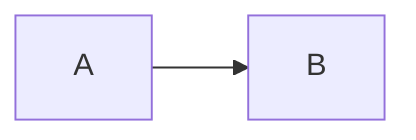

模式：repair｜profile：safe｜粗糙度：1/5｜typo_noise=off

这份说明先改成工作稿口吻，但结构先不要动。

[普通链接](https://example.com/docs) 和 [参考链接][docs]。

[docs]: https://example.com/reference

脚注内容[^one]要保留。

[^one]: 这是脚注定义。

<!-- keep this comment -->



```math
x^2 + y^2 = z^2
```

- [ ] 待确认
1. 第一步
2. 第二步

处理记录：第 1 轮只删掉套话，第 2 轮不加新场景，第 3 轮保持 safe profile，保留了原 Markdown 结构，不改变受保护 token。
噪声台账：无。
格式台账：轮次 3｜no-op｜受保护块｜safe profile 不改结构｜可回滚：是。
